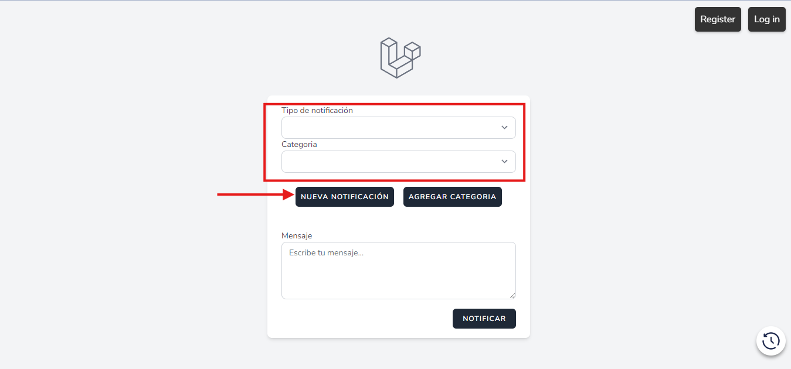
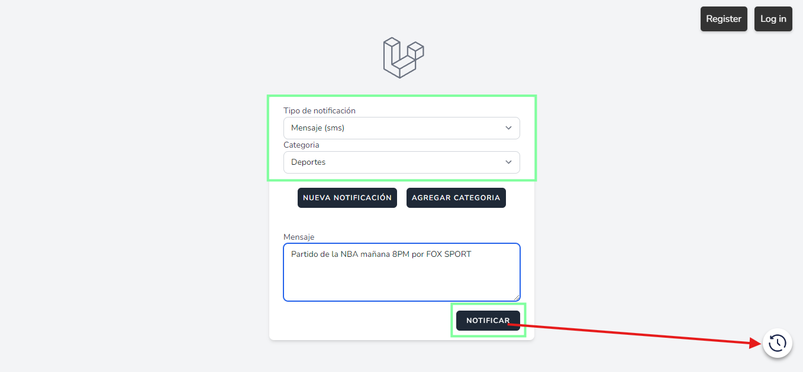
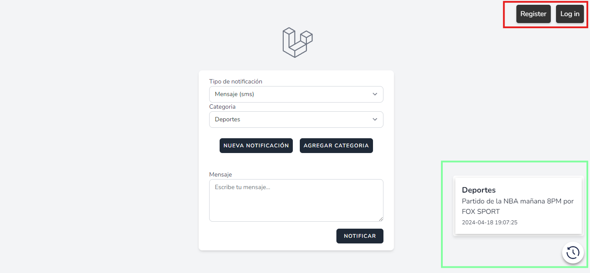
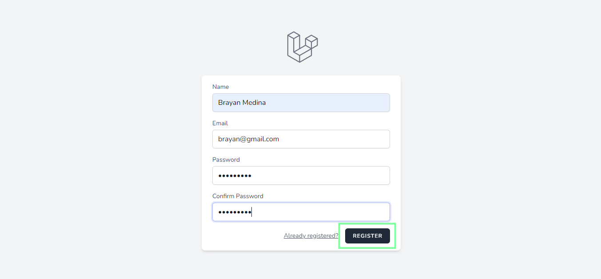
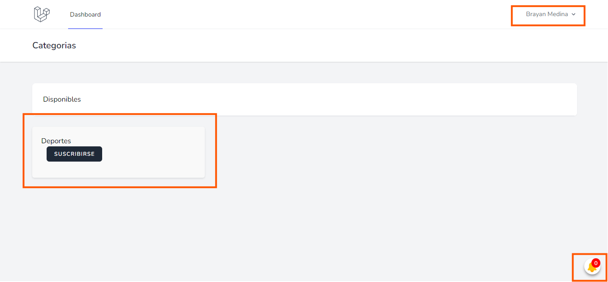
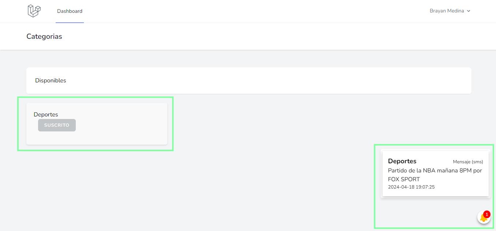

# Instalación
Antes de correr en sitio hacer las migraciones y agregar la base de datos, el nombre de la base de datos lo pueden encontrar en el archivo .env

```bash
  php artisan migrate
```

Despues de hacer las migraciones y agregar la DB ya podemos iniciar el servidor sin ningun problema

```bash
  php artisan serve
```
## Funcionamiento

El sistema cuenta administración de usuarios con base de datos, al iniciar la vista principal tendras un panel de control de notificaciones general 



Antes de poder enviar una notificación deberas crear que tipo de notificación deseas enviar y tambien crear de que  categoria



Una vez que crees tus categorias y notificaciones podras enviarla a todos los usuarios que esten suscritos a esa categoria
y tendras un registro de las notificaciones en la parte inferior derecha



Ya con la primera notificación creada si ya hay un usuario registrado iniciamos sesión o en caso contrario nos registramos



Esto nos mandara al dashboard del usuario con las categorias creadas anteriormente con la opcion de suscribirnos



Una ves que seleccionemos la categoria y me suscriba automaticamente se mostraran las notificaciones del usuario en la parte inferior derecha



De esta manera pueden crearce n numero de categorias y cada usuario puede o no estar suscrito a ella y recibir unicamente a la que esta suscrito 


## Requisitos
Se requiere crear un sistema de notificaciones, capaz de recibir un mensaje y dependiendo de la categoria del mensaje y de los usuarios suscritos a estos, se notificara al medio que ellos eligieron.

Se manejaran 3 categorias

## Categorias

- Deportes
- Finanzas
- Peliculas

## Notificaciones

- SMS
- Email
- Push notification


No se requiere que se envie realmente ningun msj, solo se debe registrar dicha notificaccion en un archivo log o en base de datos.

el log o la db debe guardar toda la informacion necesaria para identificar que se hizo correcamente y que llegara al usuario subscrito.

por ejemplo el tipo de mensaje, tipo de notificacion, datos del usuario, hora, etc.

no se requiere administracion de usuario pueden usar un Mock de usuarios en el sistema, estos deberan contar con:

- Id
- Nombre
- Email 
- Telefono
- Suscrito [] Lista de categorias a la que esta Suscrito
- Canales [] Lista de los tipos de notificacion del usuario (SMS, Email, PushNotification)


## Interfas gráfica
 
 Se requieren dos elementos principales 

 - .1 Formulario de envio: formulario simple para el envio de msj, el cual tendra 2 campos
 - a. CATEGORIA: Lista de categorias disponible
 - b. MENSAJE: Text area libre para el usuario, solo validar que el mensaje no este vacio
 - .2 Historico de logs: Lista de todos los registros ordenados de lo mas nuevo a lo mas antiguo

 ## Vamos a evaluar

 - Mejores practicas
 - Principios SOLID
 - Patrones de diseño
 - Arquitectura
 - Pruebas Unitarias
 - Base de datos
 - Prueba
